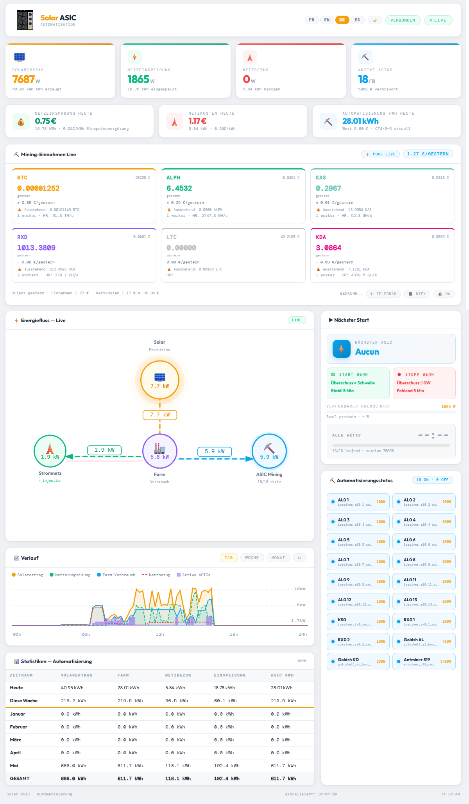

# ☀️ Solar ASIC — Solar-Mining-Dashboard für Home Assistant

<p align="center">
  <a href="README.md">Français</a> | 
  <a href="README.en.md">English</a> | 
  <a href="README.es.md">Español</a> | 
  <a href="README.de.md">Deutsch</a>
</p>

**Ein eigenständiges HTML-Dashboard**, das deine Solaranlage über Home Assistant mit deiner ASIC-Mining-Farm verbindet. Entwickelt, um den Solarüberschuss zu maximieren und **Kryptowährungen kostenlos zu schürfen** — ohne das öffentliche Stromnetz zu belasten.



---

## 🎯 Warum dieses Projekt?

Im **Bärenmarkt** fallen die Kryptokurse. Mining wird unrentabel: Die Mining-Einnahmen decken die Stromkosten nicht mehr. Die Lösung: **eine Solaranlage** nutzen, um die ASICs zu betreiben.

> **Einfache Logik**: Wenn die Sonne überschüssige Energie produziert, ist es besser, sie in Kryptowährungen umzuwandeln, als sie für 4 Cent pro kWh ins Netz einzuspeisen.

Mit diesem Projekt:
- ⛏️ Deine ASICs laufen **wenn die Sonne scheint** — Stromkosten = 0€
- 📈 Du **sammelst Krypto** während des Bärenmarkts
- 💰 Wenn der Bullenmarkt zurückkommt, sind deine angesammelten Kryptos viel mehr wert
- 🔋 Du **verbrauchst keinen Netzstrom** fürs Mining (oder sehr wenig)

---

## ✨ Funktionen

### Echtzeit-Dashboard
- 📊 **Energiefluss**: Solarertrag → Farm → Stromnetz (mit Animation)
- ⚡ **4 Kacheln**: Solarertrag, Netzeinspeisung, Netzbezug, Aktive ASICs
- 💶 **Finanzen**: Stromersparnisse, Stromkosten, Automatisierungs-kWh des Tages

### Intelligente Automatisierung
- 🌅 **Morgens**: Schaltet alle kleinen ASICs ein, sobald 120W Überschuss verfügbar
- ☀️ **Volllast**: Wechselt zum Prioritäts-ASIC (3400W) bei Überschuss ≥ 3550W
- ☁️ **Wolken**: Schaltet Prioritäts-ASIC aus, wenn Überschuss < 3200W für 5 Min, startet kleine neu
- 🌇 **Abends**: Schrittweises Abschalten bis zum letzten ASIC (≥ 120W)
- ⏱️ **Anti-Prellen-Timer**: 5 Min Stabilität vor jeder Aktion

### Mining-Einnahmen
- Unterstützung **F2Pool** (BTC, ALPH, KAS, LTC und andere)
- Unterstützung **Antpool** (KDA, BTC, ALPH, KAS, LTC und andere via HMAC-SHA256)
- Unterstützung **K1Pool** (RXD, BTC, ALPH, KAS, ETC und andere)
- EUR-Preise via **CoinGecko**
- Hashrate, aktive Worker, ausstehender Saldo

### Statistiken & Verlauf
- 📅 Monatstabelle (Heute, Diese Woche, Januar…Dezember, GESAMT)
- 📈 Verlaufsdiagramm (Tag / Woche / Monat) über HA-API
- Automatisches Auffüllen vergangener Monate aus dem HA-Verlauf

### Benachrichtigungen
- 📱 **Telegram**: Ereignisse (Start, Stop, Netzbezug beendet)
- 🔔 **ntfy.sh**: Open-Source-Push-Benachrichtigungen
- 📲 **HA Companion App**: nativer HA Notify-Service
- 🌙 **Tägliche Zusammenfassung um 20 Uhr**: ASICs-Spitze, Mining-Stunden, Einnahmen, Netto-Stromkosten

### Benutzeroberfläche
- 🌍 **4 Sprachen**: Français, English, Deutsch, Español
- 🌙 **Dunkel/Hell-Modus** (gespeichert)
- 📱 **Responsiv**: PC, Tablet, Android/iOS


### 🌙 Dunkel / Hell Modus


### 📱 Telegram-Benachrichtigungen


---

## 🛠️ Verwendete Hardware (anpassbar)

| Hardware | Rolle |
|---|---|
| **Solar-Wechselrichter** (z.B. Deye, SMA, Huawei) | Solarertrag |
| **Refoss EM06** (oder Shelly EM, andere) | 6-Kanal-CT-Leistungsmessgerät |
| **Home Assistant** (Raspberry Pi, Mini-PC…) | Zentrale Automatisierung |
| **Tuya/WiFi-Schalter** (Tasmota, ESPHome…) | ASIC Ein/Aus-Steuerung |
| **IceRiver ASIC** (AL0, KS0, RX0 — 100W) | Kleine Miner |
| **Goldshell AL Box / KD Box** (360-480W) | Mittelgroße Miner |
| **Antminer S19 / S21 / S23** (3400W) | Prioritäts-Schwerlastminer |

> ⚠️ Exakte Hardware ist nicht zwingend. Jeder ASIC, der über einen HA-Schalter steuerbar ist, funktioniert. Das Dashboard passt sich über `secrets.js` und `configuration.yaml` an.

---

## 📁 Projektstruktur

```
solar-asic/
├── dashboard_mining.html        # Haupt-Dashboard (kopieren nach /config/www/)
├── secrets.example.js           # Konfigurations-Template → umbenennen in secrets.js
├── banner.example.json          # Banner-Template → umbenennen in banner.json
├── configuration.example.yaml   # HA-Template → anpassen in configuration.yaml
├── automation_asic.example.yaml # HA-Automatisierung → anpassen in automations.yaml
├── scripts/
│   ├── antpool_kda.py           # Antpool-API-Skript (Saldo — für alle Antpool-Coins)
│   └── antpool_kda_overview.py  # Antpool-API-Skript (Hashrate + Worker — für alle Antpool-Coins)
├── docs/
│   └── MANUEL.pdf               # Vollständiges Installationshandbuch (PDF)
├── .gitignore                   # Schließt secrets.js aus, ...
└── README.md                    # Diese Datei
```

---

## 🚀 Schnellinstallation

### Schritt 1 — Dateien in Home Assistant kopieren

Via SSH oder HA Terminal Add-on:

```bash
mkdir -p /config/www
mkdir -p /config/scripts

cp dashboard_mining.html /config/www/

# Antpool-Skripte (wenn du auf Antpool minest)
cp scripts/antpool_kda.py /config/scripts/
cp scripts/antpool_kda_overview.py /config/scripts/
chmod +x /config/scripts/antpool_kda*.py

cp secrets.example.js /config/www/secrets.js
nano /config/www/secrets.js
```

### Schritt 2 — `secrets.js` konfigurieren

```javascript
const HA_URL_LOCAL = 'http://192.168.1.X:8123';
const HA_TOKEN     = 'DEIN_HA_TOKEN';
const F2POOL_USER  = 'dein_f2pool_benutzername';
const MINING_COINS = [
  { id: 'alph', symbol: 'ALPH', color: '#fa792b', decimals: 3, coingecko: 'alephium' },
];
```

### Schritt 3 — `configuration.yaml` anpassen

Inhalt von `configuration.example.yaml` in `/config/configuration.yaml` kopieren und anpassen:
- Deine Refoss/Shelly-Sensornamen
- Deine ASIC-Switch `entity_id`s
- Verwendete Pools auskommentieren

### Schritt 4 — input_datetime-Helfer erstellen

In HA: **Einstellungen → Geräte & Dienste → Helfer → + Erstellen → Datum und Uhrzeit**:
- `asic_prioritaire_surplus_depuis`
- `asic_prioritaire_deficit_depuis`
- `petits_deficit_depuis`

### Schritt 5 — Automatisierung hinzufügen

Inhalt von `automation_asic.example.yaml` in `/config/automations.yaml` kopieren.
Switch-Regex an deine ASICs anpassen.

### Schritt 6 — Home Assistant neu starten

**Einstellungen → System → Neustart**

### Schritt 7 — Dashboard öffnen

```
http://DEINE_HA_IP:8123/local/dashboard_mining.html
```

---

## ⚙️ Mining-Pool-Konfiguration

### F2Pool (BTC, ALPH, KAS, LTC…)

1. API-Schlüssel generieren auf [f2pool.com](https://www.f2pool.com) → Profil → Sicherheit → API
2. In `configuration.yaml` den `f2pool_*_raw`-Sensor auskommentieren und anpassen
3. In `secrets.js` `F2POOL_USER` ausfüllen und `MINING_COINS` auskommentieren

### Antpool (KDA und andere)

1. Schlüssel holen auf [antpool.com](https://antpool.com/userCenter/apiAccess.htm)
2. Python-Skripte installieren: `cp scripts/antpool_kda*.py /config/scripts/`
3. Testen: `python3 /config/scripts/antpool_kda_overview.py` → JSON erwartet
4. In `secrets.js` `ANTPOOL_USER_ID`, `ANTPOOL_API_KEY`, `ANTPOOL_API_SECRET` ausfüllen
5. In `configuration.yaml` Antpool-Sensoren auskommentieren

### K1Pool (RXD und andere)

1. In `configuration.yaml` den `k1pool_rxd_raw`-Sensor auskommentieren
2. Wallet-Adresse durch deine ersetzen
3. In `secrets.js` `{ id: 'rxd', ... }` in `MINING_COINS` auskommentieren

---

## 📊 Erforderliche HA-Sensoren

| HA-Sensor | Beschreibung |
|---|---|
| `sensor.production_solaire` | Momentaner Solarertrag (W) |
| `sensor.consommation_ferme` | ASIC-Verbrauch (W) |
| `sensor.consommation_reseau` | Netzbezug (W, ≥ 0) |
| `sensor.injection_reseau` | Netzeinspeisung (W, ≥ 0) |
| `sensor.surplus_solaire` | Verfügbarer Überschuss (W) |
| `sensor.asic_allumes_count` | Anzahl aktiver ASICs |
| `sensor.asic_puissance_estimee` | Geschätzte Leistung aktiver ASICs (W) |
| `sensor.prochain_asic` | Name des nächsten zu startenden ASIC |

---

## 🔔 Benachrichtigungen

```javascript
const TELEGRAM_BOT_TOKEN = '123456789:AAF...';
const TELEGRAM_CHAT_ID   = '987654321';
const NTFY_TOPIC         = 'mein-eindeutiges-topic-123';
const NTFY_SERVER        = 'https://ntfy.sh';
const HA_NOTIFY_SERVICE  = 'notify.mobile_app_mein_handy';
```

---

## 🤝 Mitwirken

Pull Requests und Issues willkommen! Dieses Projekt wird frei geteilt, um der Solar-Mining-Community zu helfen.

Wenn dir dieses Projekt nützlich ist, freue ich mich über einen ⭐ auf GitHub.

---

## 📄 Lizenz

MIT — Kostenlose Nutzung, Änderung und Weitergabe.

---

## 👤 Autor

**halo44** — Solar-Mining-Enthusiast, HA-Entwickler

> *"Im Bärenmarkt schürft die Sonne für dich."*
