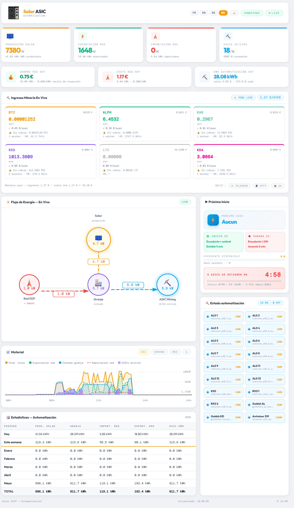

# ☀️ Solar ASIC — Panel de minería solar para Home Assistant

<p align="center">
  <a href="README.md">Français</a> | 
  <a href="README.en.md">English</a> | 
  <a href="README.es.md">Español</a> | 
  <a href="README.de.md">Deutsch</a>
</p>

**Un panel HTML independiente** que conecta tu instalación solar a tu granja de minería ASIC a través de Home Assistant. Diseñado para maximizar el uso del excedente solar y **minar criptomonedas gratis** — sin tocar la red eléctrica nacional.



---

## 🎯 ¿Por qué este proyecto?

En un **mercado bajista**, los precios de las criptomonedas caen. Minar se vuelve deficitario: los ingresos de minería ya no cubren los costes de electricidad. La solución: **usar una instalación solar** para alimentar los ASICs.

> **Lógica simple**: si el sol produce energía excedente, es mejor convertirla en criptomonedas que inyectarla a la red por 4 céntimos el kWh.

Con este proyecto:
- ⛏️ Tus ASICs funcionan **cuando hay sol** — coste eléctrico = 0€
- 📈 **Acumulas cripto** durante el mercado bajista
- 💰 Cuando vuelve el mercado alcista, tus cripto acumuladas valen mucho más
- 🔋 **No consumes electricidad de la red** para minar (o muy poco)

---

## ✨ Características

### Panel en tiempo real
- 📊 **Flujo de energía**: Producción solar → Granja → Red eléctrica (con animación)
- ⚡ **4 indicadores**: Producción solar, Exportación red, Importación red, ASICs activos
- 💶 **Finanzas**: Ahorro en electricidad, coste red, kWh de automatización del día

### Automatización inteligente
- 🌅 **Mañana**: Enciende todos los ASICs pequeños disponibles desde 120W de excedente
- ☀️ **Pleno sol**: Cambia al ASIC prioritario (3400W) cuando excedente ≥ 3550W
- ☁️ **Nube**: Apaga el ASIC prioritario si excedente < 3200W durante 5 min, reinicia los pequeños
- 🌇 **Tarde**: Apagado progresivo por lotes hasta el último ASIC (≥ 120W)
- ⏱️ **Temporizador anti-rebote**: 5 min de estabilidad antes de cada acción

### Ingresos de minería
- Soporte **F2Pool** (BTC, ALPH, KAS, LTC y otros)
- Soporte **Antpool** (KDA, BTC, ALPH, KAS, LTC y otros via HMAC-SHA256)
- Soporte **K1Pool** (RXD, BTC, ALPH, KAS, ETC y otros)
- Precios en EUR via **CoinGecko**
- Hashrate, workers activos, saldo pendiente

### Estadísticas e historial
- 📅 Tabla mensual (Hoy, Esta semana, Enero…Diciembre, TOTAL)
- 📈 Gráfico histórico (Día / Semana / Mes) desde API HA
- Relleno automático de meses pasados desde el historial HA

### Notificaciones
- 📱 **Telegram**: eventos (inicio, parada, importación resuelta)
- 🔔 **ntfy.sh**: notificaciones push de código abierto
- 📲 **HA Companion App**: servicio notify nativo de HA
- 🌙 **Resumen diario a las 20h**: pico de ASICs, horas de minería, ingresos, coste neto

### Interfaz
- 🌍 **4 idiomas**: Français, English, Deutsch, Español
- 🌙 **Modo oscuro/claro** (recordado)
- 📱 **Responsive**: PC, tableta, Android/iOS


### 🌙 Modo oscuro / Modo claro


### 📱 Notificaciones Telegram


---

## 🛠️ Hardware utilizado (adaptable)

| Hardware | Rol |
|---|---|
| **Inversor solar** (ej: Deye, SMA, Huawei) | Producción solar |
| **Refoss EM06** (o Shelly EM, otro) | Monitor de potencia 6 canales CT |
| **Home Assistant** (Raspberry Pi, mini PC…) | Automatización central |
| **Interruptores Tuya/WiFi** (Tasmota, ESPHome…) | Control ON/OFF de los ASICs |
| **ASIC IceRiver** (AL0, KS0, RX0 — 100W) | Mineros pequeños |
| **Goldshell AL Box / KD Box** (360-480W) | Mineros intermedios |
| **Antminer S19 / S21 / S23** (3400W) | Minero prioritario de alta potencia |

> ⚠️ El hardware exacto no es obligatorio. Cualquier ASIC controlable por un switch de HA funciona. El panel se adapta mediante `secrets.js` y `configuration.yaml`.

---

## 📁 Estructura del proyecto

```
solar-asic/
├── dashboard_mining.html        # Panel principal (copiar en /config/www/)
├── secrets.example.js           # Plantilla de config → renombrar a secrets.js
├── banner.example.json          # Plantilla de banner → renombrar a banner.json
├── configuration.example.yaml   # Plantilla HA → adaptar en configuration.yaml
├── automation_asic.example.yaml # Automatización HA → adaptar en automations.yaml
├── scripts/
│   ├── antpool_kda.py           # Script API Antpool (saldo — para todas las cripto de Antpool)
│   └── antpool_kda_overview.py  # Script API Antpool (hashrate + workers — para todas las cripto de Antpool)
├── docs/
│   └── MANUEL.pdf               # Manual de instalación completo (PDF)
├── .gitignore                   # Excluye secrets.js, ...
└── README.md                    # Este archivo
```

---

## 🚀 Instalación rápida

### Paso 1 — Copiar archivos a Home Assistant

Via SSH o el Add-on Terminal de HA:

```bash
mkdir -p /config/www
mkdir -p /config/scripts

cp dashboard_mining.html /config/www/

# Scripts Antpool (si minas en Antpool)
cp scripts/antpool_kda.py /config/scripts/
cp scripts/antpool_kda_overview.py /config/scripts/
chmod +x /config/scripts/antpool_kda*.py

cp secrets.example.js /config/www/secrets.js
nano /config/www/secrets.js
```

### Paso 2 — Configurar `secrets.js`

```javascript
const HA_URL_LOCAL = 'http://192.168.1.X:8123';
const HA_TOKEN     = 'TU_TOKEN_HA';
const F2POOL_USER  = 'tu_usuario_f2pool';
const MINING_COINS = [
  { id: 'alph', symbol: 'ALPH', color: '#fa792b', decimals: 3, coingecko: 'alephium' },
];
```

### Paso 3 — Adaptar `configuration.yaml`

Copia el contenido de `configuration.example.yaml` en `/config/configuration.yaml` y adapta:
- Los nombres de tus sensores Refoss/Shelly
- Los `entity_id` de tus switches ASIC
- Descomenta los pools que utilizas

### Paso 4 — Crear los helpers input_datetime

En HA: **Configuración → Dispositivos y servicios → Helpers → + Crear → Fecha y hora**:
- `asic_prioritaire_surplus_depuis`
- `asic_prioritaire_deficit_depuis`
- `petits_deficit_depuis`

### Paso 5 — Añadir la automatización

Copia el contenido de `automation_asic.example.yaml` en `/config/automations.yaml`.
Adapta la regex de switches a tus ASICs.

### Paso 6 — Reiniciar Home Assistant

**Configuración → Sistema → Reiniciar**

### Paso 7 — Abrir el panel

```
http://TU_IP_HA:8123/local/dashboard_mining.html
```

---

## ⚙️ Configuración de pools de minería

### F2Pool (BTC, ALPH, KAS, LTC…)

1. Genera una clave API en [f2pool.com](https://www.f2pool.com) → Perfil → Seguridad → API
2. En `configuration.yaml`, descomenta y adapta el sensor `f2pool_*_raw`
3. En `secrets.js`, rellena `F2POOL_USER` y descomenta `MINING_COINS`

### Antpool (KDA y otros)

1. Obtén tus claves en [antpool.com](https://antpool.com/userCenter/apiAccess.htm)
2. Instala scripts Python: `cp scripts/antpool_kda*.py /config/scripts/`
3. Prueba: `python3 /config/scripts/antpool_kda_overview.py` → debe devolver JSON
4. En `secrets.js`, rellena `ANTPOOL_USER_ID`, `ANTPOOL_API_KEY`, `ANTPOOL_API_SECRET`
5. En `configuration.yaml`, descomenta los sensores Antpool

### K1Pool (RXD y otros)

1. En `configuration.yaml`, descomenta el sensor `k1pool_rxd_raw`
2. Reemplaza la dirección de wallet por la tuya
3. En `secrets.js`, descomenta `{ id: 'rxd', ... }` en `MINING_COINS`

---

## 📊 Sensores HA requeridos

| Sensor HA | Descripción |
|---|---|
| `sensor.production_solaire` | Producción solar instantánea (W) |
| `sensor.consommation_ferme` | Consumo ASIC (W) |
| `sensor.consommation_reseau` | Importación red (W, ≥ 0) |
| `sensor.injection_reseau` | Exportación red (W, ≥ 0) |
| `sensor.surplus_solaire` | Excedente disponible (W) |
| `sensor.asic_allumes_count` | Número de ASICs activos |
| `sensor.asic_puissance_estimee` | Potencia estimada de ASICs activos (W) |
| `sensor.prochain_asic` | Nombre del próximo ASIC a iniciar |

---

## 🔔 Notificaciones

```javascript
const TELEGRAM_BOT_TOKEN = '123456789:AAF...';
const TELEGRAM_CHAT_ID   = '987654321';
const NTFY_TOPIC         = 'mi-topic-unico-123';
const NTFY_SERVER        = 'https://ntfy.sh';
const HA_NOTIFY_SERVICE  = 'notify.mobile_app_mi_movil';
```

---

## 🤝 Contribución

¡Pull requests e issues bienvenidos! Este proyecto se comparte libremente para ayudar a la comunidad de mineros solares.

Si encuentras útil este proyecto, se agradece una ⭐ en GitHub.

---

## 📄 Licencia

MIT — Libre de usar, modificar y redistribuir.

---

## 👤 Autor

**halo44** — entusiasta del minado solar, desarrollador HA

> *"Durante el mercado bajista, el sol mina por ti."*
