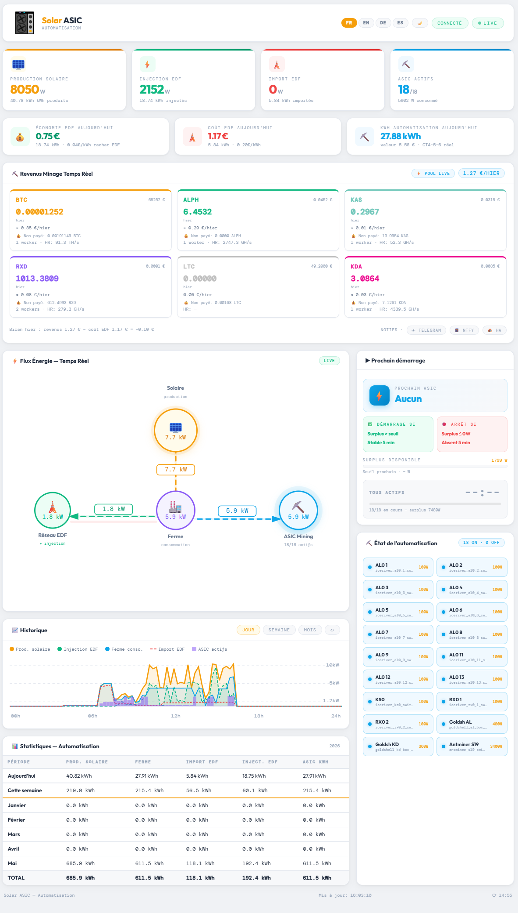

# ☀️ Solar ASIC — Dashboard de minage solaire pour Home Assistant

<p align="center">
  <a href="README.fr.md">Français</a> | 
  <a href="README.md">English</a> | 
  <a href="README.es.md">Español</a> | 
  <a href="README.de.md">Deutsch</a>
</p>

**Un dashboard HTML standalone** qui connecte votre installation solaire à votre ferme de minage ASIC via Home Assistant. Conçu pour maximiser l'utilisation du surplus solaire et **miner des cryptomonnaies gratuitement** — sans toucher au réseau national d'électricité.



---

## 🎯 Pourquoi ce projet ?

En **bear market**, le cours des cryptomonnaies chute. Miner devient déficitaire : les revenus de minage ne couvrent plus le coût de l'électricité. La solution : **utiliser une installation solaire** pour alimenter les ASIC.

> **Logique simple** : si le soleil produit de l'énergie excédentaire, autant la transformer en cryptomonnaies plutôt que de l'injecter dans le réseau à 4 centimes d'euro le kWh.

Avec ce projet :
- ⛏️ Tes ASIC tournent **quand il y a du soleil** — coût électricité = 0€
- 📈 Tu **accumules des crypto** pendant le bear market
- 💰 Quand le bull market revient, tes crypto accumulées valent beaucoup plus
- 🔋 Tu **ne consommes pas de réseau EDF** pour le minage (ou très peu)

---

## ✨ Fonctionnalités

### Tableau de bord temps réel
- 📊 **Flux d'énergie** : Production solaire → Ferme → Réseau EDF (avec animation)
- ⚡ **4 tuiles** : Production solaire, Injection EDF, Import EDF, ASIC actifs
- 💶 **Finance** : Économie EDF, coût EDF, kWh automatisation du jour

### Automatisation intelligente
- 🌅 **Matin** : Allume tous les petits ASIC disponibles dès 120W de surplus
- ☀️ **Plein soleil** : Bascule sur l'asic prioritaire (3400W) quand surplus ≥ 3550W
- ☁️ **Nuage** : Éteint l'asic prioritaire si surplus < 3200W pendant 5 min, relance les petits
- 🌇 **Soir** : Extinction progressive par lots jusqu'au dernier ASIC (≥ 120W)
- ⏱️ **Tempo anti-rebond** : 5 min de stabilité avant chaque action

### Revenus de minage
- Support **F2Pool** (BTC, ALPH, KAS, LTC et autres)
- Support **Antpool** (KDA, BTC, ALPH, KAS, LTC et autres via HMAC-SHA256)
- Support **K1Pool** (RXD, BTC, ALPH, KAS, ETC et autres)
- Prix en EUR via **CoinGecko**
- Hashrate, workers actifs, solde non payé

### Statistiques & Historique
- 📅 Tableau mensuel (Aujourd'hui, Cette semaine, Janvier…Décembre, TOTAL)
- 📈 Graphique historique (Jour / Semaine / Mois) depuis l'API HA
- Rétro-remplissage automatique des mois passés depuis l'historique HA

### Notifications
- 📱 **Telegram** : événements (démarrage, arrêt, import résolu)
- 🔔 **ntfy.sh** : notifications push open-source
- 📲 **HA Companion App** : notify service natif HA
- 🌙 **Bilan quotidien à 20h** : pic ASICs, heures de minage, revenus, coût EDF net

### Interface
- 🌍 **4 langues** : Français, English, Deutsch, Español
- 🌙 **Mode sombre/clair** (mémorisé)
- 📱 **Responsive** : PC, tablette, Android/iOS


### 🌙 Mode sombre / Mode clair


### 📱 Notifications Telegram


---

## 🛠️ Matériel utilisé (adaptable)

| Matériel | Rôle |
|---|---|
| **Onduleur solaire** (ex: Deye, SMA, Huawei) | Production solaire |
| **Refoss EM06** (ou Shelly EM, autre) | Mesure conso 6 canaux CT |
| **Home Assistant** (Raspberry Pi, mini PC…) | Automatisation centrale |
| **Switches Tuya/WiFi** (Tasmota, ESPHome…) | Contrôle ON/OFF des ASIC |
| **ASIC IceRiver** (AL0, KS0, RX0 — 100W) | Petits mineurs |
| **Goldshell AL Box / KD Box** (360-480W) | Mineurs intermédiaires |
| **Antminer S19 / S21 / S23** (3400W) | Gros mineur prioritaire soleil fort |

> ⚠️ Le matériel exact n'est pas obligatoire. Tout ASIC contrôlable par un switch HA fonctionne. Le dashboard s'adapte via `secrets.js` et `configuration.yaml`.

---

## 📁 Structure du projet

```
solar-asic/
├── dashboard_mining.html        # Dashboard principal (copier dans /config/www/)
├── secrets.example.js           # Template config → renommer en secrets.js
├── banner.example.json          # Template bannière → renommer en banner.json
├── configuration.example.yaml   # Template HA → adapter dans configuration.yaml
├── automation_asic.example.yaml # Automation HA → adapter dans automations.yaml
├── scripts/
│   ├── antpool_kda.py           # Script API Antpool (balance, marche avec toutes les crypto Antpool)
│   └── antpool_kda_overview.py  # Script API Antpool (hashrate + workers, marche avec toutes les crypto Antpool)
├── docs/
│   └── MANUEL.pdf               # Manuel d'installation complet (PDF)
├── .gitignore                   # Exclut secrets.js, banner.json...
└── README.md                    # Ce fichier
```

---

## 🚀 Installation rapide

### Étape 1 — Copier les fichiers dans Home Assistant

Via SSH ou l'Add-on Terminal de HA :

```bash
mkdir -p /config/www
mkdir -p /config/scripts

cp dashboard_mining.html /config/www/

# Scripts Antpool (si tu mines sur Antpool)
cp scripts/antpool_kda.py /config/scripts/
cp scripts/antpool_kda_overview.py /config/scripts/
chmod +x /config/scripts/antpool_kda*.py

cp secrets.example.js /config/www/secrets.js
nano /config/www/secrets.js
```

### Étape 2 — Configurer `secrets.js`

```javascript
const HA_URL_LOCAL = 'http://192.168.1.X:8123';
const HA_TOKEN     = 'TON_TOKEN_HA';
const F2POOL_USER  = 'ton_user_f2pool';
const MINING_COINS = [
  { id: 'alph', symbol: 'ALPH', color: '#fa792b', decimals: 3, coingecko: 'alephium' },
];
```

### Étape 3 — Adapter `configuration.yaml`

Copie le contenu de `configuration.example.yaml` dans `/config/configuration.yaml` et adapte :
- Les noms de tes sensors Refoss/Shelly
- Les `entity_id` de tes switches ASIC
- Décommente les pools que tu utilises

### Étape 4 — Créer les helpers input_datetime

Dans HA : **Paramètres → Appareils et services → Helpers → + Créer → Date et heure** :
- `asic_prioritaire_surplus_depuis`
- `asic_prioritaire_deficit_depuis`
- `petits_deficit_depuis`

### Étape 5 — Ajouter l'automation

Copie le contenu de `automation_asic.example.yaml` dans `/config/automations.yaml`.
Adapte la regex des switches à tes ASIC.

### Étape 6 — Redémarrer Home Assistant

**Paramètres → Système → Redémarrer**

### Étape 7 — Ouvrir le dashboard

```
http://IP_DE_TON_HA:8123/local/dashboard_mining.html
```

---

## ⚙️ Configuration des pools de minage

### F2Pool (BTC, ALPH, KAS, LTC…)

1. Génère une clé API sur [f2pool.com](https://www.f2pool.com) → Profil → Sécurité → API
2. Dans `configuration.yaml`, décommente et adapte le sensor `f2pool_*_raw`
3. Dans `secrets.js`, remplis `F2POOL_USER` et décommente les `MINING_COINS`

### Antpool (KDA et autres)

1. Récupère tes clés sur [antpool.com](https://antpool.com/userCenter/apiAccess.htm)
2. Installe les scripts Python : `cp scripts/antpool_kda*.py /config/scripts/`
3. Teste : `python3 /config/scripts/antpool_kda_overview.py` → doit retourner un JSON
4. Dans `secrets.js`, remplis `ANTPOOL_USER_ID`, `ANTPOOL_API_KEY`, `ANTPOOL_API_SECRET`
5. Dans `configuration.yaml`, décommente les sensors Antpool

### K1Pool (RXD et autres)

1. Dans `configuration.yaml`, décommente le sensor `k1pool_rxd_raw`
2. Remplace l'adresse wallet par la tienne
3. Dans `secrets.js`, décommente `{ id: 'rxd', ... }` dans `MINING_COINS`

---

## 📊 Sensors HA requis

| Sensor HA | Description |
|---|---|
| `sensor.production_solaire` | Production solaire instantanée (W) |
| `sensor.consommation_ferme` | Consommation ASIC (W) |
| `sensor.consommation_reseau` | Import EDF (W, ≥ 0) |
| `sensor.injection_reseau` | Export EDF (W, ≥ 0) |
| `sensor.surplus_solaire` | Surplus disponible (W) |
| `sensor.asic_allumes_count` | Nombre d'ASIC allumés |
| `sensor.asic_puissance_estimee` | Puissance estimée des ASIC allumés (W) |
| `sensor.prochain_asic` | Nom du prochain ASIC à démarrer |

---

## 🔔 Notifications

```javascript
const TELEGRAM_BOT_TOKEN = '123456789:AAF...';
const TELEGRAM_CHAT_ID   = '987654321';
const NTFY_TOPIC         = 'mon-topic-unique-123';
const NTFY_SERVER        = 'https://ntfy.sh';
const HA_NOTIFY_SERVICE  = 'notify.mobile_app_mon_telephone';
```

### Événements notifiés
- ✅ Import EDF résolu (les ASIC ont démarré)
- ⬇️ ASIC prioritaire (S19, S21, S23) éteint
- 🔨 Ferme ASIC éteinte (soir)
- 📊 **Bilan quotidien à 20h** : pic ASICs, heures de minage, revenus, coût EDF net

---

## 🤝 Contribution

Pull requests et issues bienvenues ! Ce projet est partagé librement pour aider la communauté des mineurs solaires.

Si tu trouves ce projet utile, une ⭐ sur GitHub est appréciée.

---

## 📄 Licence

MIT — Libre d'utilisation, modification et redistribution.

---

## 👤 Auteur

**halo44** — passionné de minage solaire, développeur HA

> *"Pendant le bear market, le soleil mine pour toi."*
