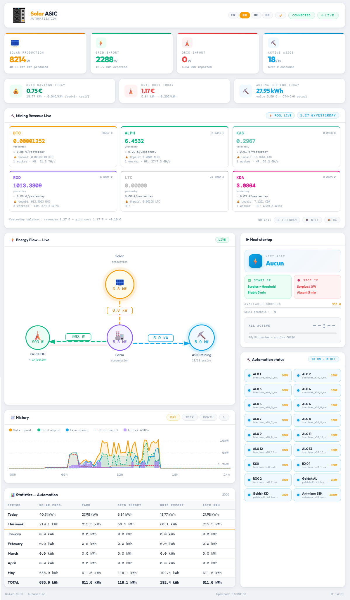
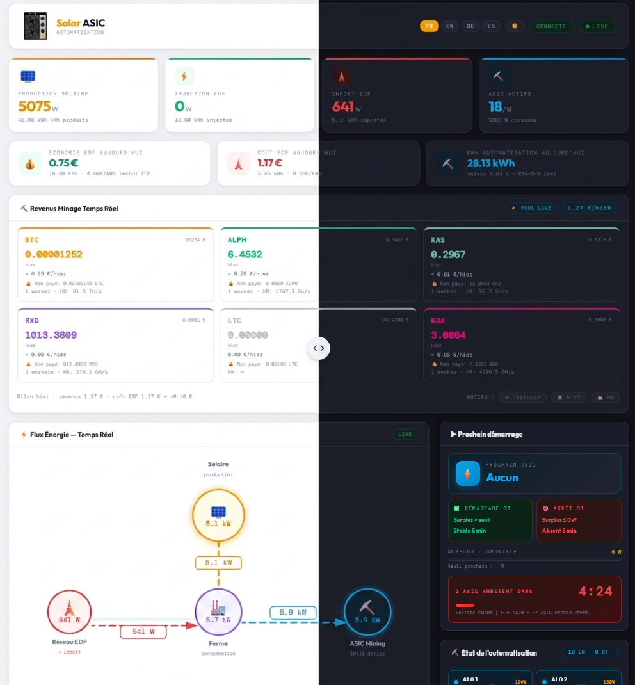
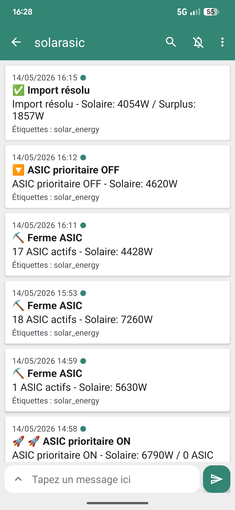

# ☀️ Solar ASIC — Solar Mining Dashboard for Home Assistant

<p align="center">
  <a href="README.fr.md">Français</a> | 
  <a href="README.md">English</a> | 
  <a href="README.es.md">Español</a> | 
  <a href="README.de.md">Deutsch</a>
</p>

**A standalone HTML dashboard** that connects your solar installation to your ASIC mining farm via Home Assistant. Designed to maximize the use of solar surplus and **mine cryptocurrencies for free** — without touching the national electricity grid.



---

## 🎯 Why this project?

In a **bear market**, cryptocurrency prices drop. Mining becomes unprofitable: mining revenues no longer cover electricity costs. The solution: **use a solar installation** to power the ASICs.

> **Simple logic**: if the sun produces excess energy, it's better to turn it into cryptocurrencies rather than injecting it into the grid at 4 cents per kWh.

With this project:
- ⛏️ Your ASICs run **when there's sun** — electricity cost = €0
- 📈 You **accumulate crypto** during the bear market
- 💰 When the bull market returns, your accumulated crypto is worth much more
- 🔋 You **don't consume grid electricity** for mining (or very little)

---

## ✨ Features

### Real-time dashboard
- 📊 **Energy flow**: Solar production → Farm → Grid (with animation)
- ⚡ **4 tiles**: Solar production, Grid export, Grid import, Active ASICs
- 💶 **Finance**: Grid savings, grid cost, automation kWh of the day

### Smart automation
- 🌅 **Morning**: Turns on all small available ASICs from 120W surplus
- ☀️ **Full sun**: Switches to priority ASIC (3400W) when surplus ≥ 3550W
- ☁️ **Cloud**: Turns off priority ASIC if surplus < 3200W for 5 min, restarts smalls
- 🌇 **Evening**: Progressive batch shutdown down to last ASIC (≥ 120W)
- ⏱️ **Anti-bounce timer**: 5 min stability before each action

### Mining revenues
- Support **F2Pool** (BTC, ALPH, KAS, LTC and others)
- Support **Antpool** (KDA, BTC, ALPH, KAS, LTC and others via HMAC-SHA256)
- Support **K1Pool** (RXD, BTC, ALPH, KAS, ETC and others)
- EUR prices via **CoinGecko**
- Hashrate, active workers, unpaid balance

### Statistics & History
- 📅 Monthly table (Today, This week, January…December, TOTAL)
- 📈 Historical chart (Day / Week / Month) from HA API
- Automatic backfill of past months from HA history

### Notifications
- 📱 **Telegram**: events (start, stop, grid import resolved)
- 🔔 **ntfy.sh**: open-source push notifications
- 📲 **HA Companion App**: native HA notify service
- 🌙 **Daily summary at 8pm**: peak ASICs, mining hours, revenues, net grid cost

### Interface
- 🌍 **4 languages**: Français, English, Deutsch, Español
- 🌙 **Dark/light mode** (remembered)
- 📱 **Responsive**: PC, tablet, Android/iOS


### 🌙 Dark mode / Light mode



### 📱 Telegram notifications



---

## 🛠️ Hardware used (adaptable)

| Hardware | Role |
|---|---|
| **Solar inverter** (e.g. Deye, SMA, Huawei) | Solar production |
| **Refoss EM06** (or Shelly EM, other) | 6-channel CT power monitor |
| **Home Assistant** (Raspberry Pi, mini PC…) | Central automation |
| **Tuya/WiFi switches** (Tasmota, ESPHome…) | ASIC ON/OFF control |
| **IceRiver ASIC** (AL0, KS0, RX0 — 100W) | Small miners |
| **Goldshell AL Box / KD Box** (360-480W) | Mid-range miners |
| **Antminer S19 / S21 / S23** (3400W) | Priority heavy miner |

> ⚠️ Exact hardware is not mandatory. Any ASIC controllable by a HA switch works. The dashboard adapts via `secrets.js` and `configuration.yaml`.

---

## 📁 Project structure

```
solar-asic/
├── dashboard_mining.html        # Main dashboard (copy to /config/www/)
├── secrets.example.js           # Config template → rename to secrets.js
├── banner.example.json          # Banner template → rename to banner.json
├── configuration.example.yaml   # HA template → adapt in configuration.yaml
├── automation_asic.example.yaml # HA automation → adapt in automations.yaml
├── scripts/
│   ├── antpool_kda.py           # Antpool API script (balance — works for all Antpool coins)
│   └── antpool_kda_overview.py  # Antpool API script (hashrate + workers — works for all Antpool coins)
├── docs/
│   └── MANUEL.pdf               # Complete installation manual (PDF)
├── .gitignore                   # Excludes secrets.js, ...
└── README.md                    # This file
```

---

## 🚀 Quick installation

### Step 1 — Copy files to Home Assistant

Via SSH or HA Terminal add-on:

```bash
mkdir -p /config/www
mkdir -p /config/scripts

cp dashboard_mining.html /config/www/

# Antpool scripts (if mining on Antpool)
cp scripts/antpool_kda.py /config/scripts/
cp scripts/antpool_kda_overview.py /config/scripts/
chmod +x /config/scripts/antpool_kda*.py

cp secrets.example.js /config/www/secrets.js
nano /config/www/secrets.js
```

### Step 2 — Configure `secrets.js`

```javascript
const HA_URL_LOCAL = 'http://192.168.1.X:8123';
const HA_TOKEN     = 'YOUR_HA_TOKEN';
const F2POOL_USER  = 'your_f2pool_username';
const MINING_COINS = [
  { id: 'alph', symbol: 'ALPH', color: '#fa792b', decimals: 3, coingecko: 'alephium' },
];
```

### Step 3 — Adapt `configuration.yaml`

Copy `configuration.example.yaml` content into `/config/configuration.yaml` and adapt:
- Your Refoss/Shelly sensor names
- Your ASIC switch `entity_id`s
- Uncomment the pools you use

### Step 4 — Create input_datetime helpers

In HA: **Settings → Devices & Services → Helpers → + Create → Date and time**:
- `asic_prioritaire_surplus_depuis`
- `asic_prioritaire_deficit_depuis`
- `petits_deficit_depuis`

### Step 5 — Add the automation

Copy `automation_asic.example.yaml` content into `/config/automations.yaml`.
Adapt the switch regex to your ASICs.

### Step 6 — Restart Home Assistant

**Settings → System → Restart**

### Step 7 — Open the dashboard

```
http://YOUR_HA_IP:8123/local/dashboard_mining.html
```

---

## ⚙️ Mining pool configuration

### F2Pool (BTC, ALPH, KAS, LTC…)

1. Generate an API key at [f2pool.com](https://www.f2pool.com) → Profile → Security → API
2. In `configuration.yaml`, uncomment and adapt the `f2pool_*_raw` sensor
3. In `secrets.js`, fill in `F2POOL_USER` and uncomment `MINING_COINS`

### Antpool (KDA and others)

1. Get your keys at [antpool.com](https://antpool.com/userCenter/apiAccess.htm)
2. Install Python scripts: `cp scripts/antpool_kda*.py /config/scripts/`
3. Test: `python3 /config/scripts/antpool_kda_overview.py` → should return JSON
4. In `secrets.js`, fill in `ANTPOOL_USER_ID`, `ANTPOOL_API_KEY`, `ANTPOOL_API_SECRET`
5. In `configuration.yaml`, uncomment Antpool sensors

### K1Pool (RXD and others)

1. In `configuration.yaml`, uncomment the `k1pool_rxd_raw` sensor
2. Replace wallet address with yours
3. In `secrets.js`, uncomment `{ id: 'rxd', ... }` in `MINING_COINS`

---

## 📊 Required HA sensors

| HA Sensor | Description |
|---|---|
| `sensor.production_solaire` | Instantaneous solar production (W) |
| `sensor.consommation_ferme` | ASIC consumption (W) |
| `sensor.consommation_reseau` | Grid import (W, ≥ 0) |
| `sensor.injection_reseau` | Grid export (W, ≥ 0) |
| `sensor.surplus_solaire` | Available surplus (W) |
| `sensor.asic_allumes_count` | Number of active ASICs |
| `sensor.asic_puissance_estimee` | Estimated power of active ASICs (W) |
| `sensor.prochain_asic` | Name of next ASIC to start |

---

## 🔔 Notifications

```javascript
const TELEGRAM_BOT_TOKEN = '123456789:AAF...';
const TELEGRAM_CHAT_ID   = '987654321';
const NTFY_TOPIC         = 'my-unique-topic-123';
const NTFY_SERVER        = 'https://ntfy.sh';
const HA_NOTIFY_SERVICE  = 'notify.mobile_app_my_phone';
```

### Notified events
- ✅ Grid import resolved (ASICs started)
- ⬇️ Priority ASIC (S19, S21, S23) off
- 🔨 Mining farm off (evening)
- 📊 **Daily summary at 8pm**: peak ASICs, mining hours, revenues, net cost

---

## 🤝 Contributing

Pull requests and issues welcome! This project is freely shared to help the solar mining community.

If you find this project useful, a ⭐ on GitHub is appreciated.

---

## 📄 License

MIT — Free to use, modify and redistribute.

---

## 👤 Author

**halo44** — solar mining enthusiast, HA developer

> *"During the bear market, the sun mines for you."*
